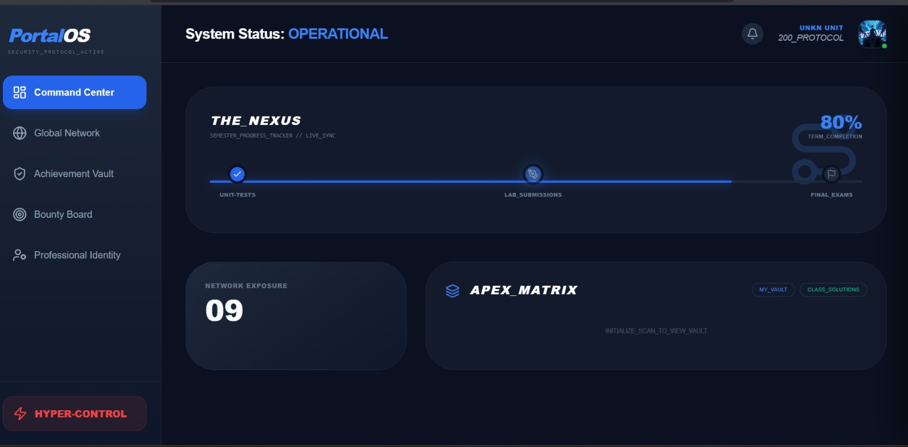

<p align="center">
  <a href="https://shiroonigami23.free.nf/">
    
  </a>
</p>

<h1 align="center">🌌 Portal-OS <sub>[Aetheris Core]</sub></h1>

<p align="center">
  <strong>The Sovereign Intelligence Network for the Elite</strong>
  <br>
  <i>Reconnaissance • Encryption • Infinite Storage • God Mode</i>
</p>

<div align="center">

[](https://shiroonigami23.free.nf/)
[](./CHANGELOG.md)
[](./LICENSE.md)

<br>

[](./includes/connection.php)
[](./db.sql)
[](./css/style.css)
[](./js/talkin.js)

</div>

<br>

<p align="center">
  <a href="https://shiroonigami23.free.nf/">
    
  </a>
  &nbsp;
  <a href="./admin/admin_dashboard.php">
    
  </a>
  &nbsp;
  <a href="./db.sql">
    
  </a>
</p>

---
## 🌟 Introduction

**Portal-OS** (codenamed *Aetheris Core*) is the definitive digital sovereignty architecture for the **2022-26 Elite**.

It is not merely a student portal; it is a **Full-Stack Operating System** designed for academic reconnaissance and resource superiority. Engineered with a "security-first" doctrine, Portal-OS integrates real-time encrypted communication, a GitHub-backed infinite storage vault, and a "God Mode" kernel that grants absolute administrative control over the file system directly from the browser.

This is where **High-Fidelity Intelligence** meets **Cinematic User Experience**.

---

## 🧭 Operational Intelligence Modules

### 🛡️ **God Mode Protocol (The Architect)**
> *File: `admin/admin_dashboard.php`*
- **Omnipotent Control**: A custom-built file manager allowing you to **Create, Edit, Rename, and Nuke** any file on the server without FTP access.
- **Surveillance Grid**: Live tracking of user infiltration (profile visits) and broadcast verification queues.
- **Ban Hammer**: Instant termination of rogue nodes (users) from the network.

### 📡 **Neural Link (P2P Mesh Network)**
> *File: `js/talkin.js` & `api/signaling_handler.php`*
- **Zero-Latency Audio**: WebRTC-powered voice channels that connect users peer-to-peer, bypassing central server bottlenecks.
- **Encrypted Uplink**: A secure signaling server handles the handshake, ensuring private, crystal-clear voice transmission.
- **Silent DM Injection**: Messages are injected directly into the recipient's SQL stream, visible instantly upon drawer activation.

### ☁️ **Apex Matrix (The Infinite Vault)**
> *File: `api/get_github_files.php`*
- **Git-Backed Ledger**: Bypasses hosting storage limits by utilizing private GitHub repositories as an infinite cloud backend for solution storage.
- **Smart Categorization**: The system automatically sorts uploaded intelligence into "Certifications," "Labs," or "Exams" based on filename heuristics.

### ⚡ **Background Intelligence Engine (Service Worker v2.2)**
> *File: `sw.js`*
- **Stale-While-Revalidate**: Instant page loads by serving cached shells while fetching fresh data silently in the background.
- **Push Notification Handshake**: Delivers "Incoming Transmission" alerts to the user's device even when the browser tab is closed (Neural Link established).

### 💎 **Glassmorphism v2.0 UI**
> *File: `css/style.css`*
- **Cinematic Interface**: A reactive environment built with **TailwindCSS** and **GSAP Animations**.
- **Dynamic Semester Tracker**: A live progress bar that calculates the exact percentage of the semester completed based on current datetime metrics.

---

## 🧩 Architectural Tech Stack

| Operational Layer | Arsenal (Technology) | Protocol / Capability |
| :--- | :--- | :--- |
| **🧠 Hypervisor Core** | **PHP 8.2+** | *Server-Side Logic / REST API Gateway* |
| **🗄️ Persistence** | **MySQL (MariaDB)** | *ACID-Compliant Relational Storage* |
| **📡 Neural Mesh** | **WebRTC & SimplePeer** | *UDP/TCP P2P Audio & Data Streaming* |
| **👁️ Kinetic UI** | **TailwindCSS & GSAP** | *Hardware-Accelerated Visual Engine* |
| **☁️ Infinite Void** | **GitHub API (v3)** | *Decentralized Document Storage (No-DB)* |
| **⚡ Background Ops** | **Service Worker API** | *Push API & Cache Storage (Offline-First)* |

---

## ⚙️ Deployment Protocol

### Phase 1: Acquisition
Initialize the repository on your local command terminal.
```bash
git clone [https://github.com/0902cs231028-sys/Portal-OS.git](https://github.com/0902cs231028-sys/Portal-OS.git)
cd Portal-OS
```

### Phase 2: Database Injection
1.  Access your **MySQL/MariaDB** interface (phpMyAdmin or CLI).
2.  Create a new sovereign database named: `portal_os_db`
3.  Import the schema file located at: `db.sql`
    * *This will construct the user nodes, encrypted vault indices, and P2P signaling tables.*

### Phase 3: Neural Link Configuration
Edit the core connection file to establish links with your database and GitHub Cloud.
> *Target File: `includes/connection.php`*

```php
// 1. DATABASE CREDENTIALS
define('DB_HOST', 'localhost');
define('DB_USER', 'root');
define('DB_PASS', '');
define('DB_NAME', 'portal_os_db');

// 2. APEX VAULT KEYS (GitHub Integration)
// Generate a PAT (Personal Access Token) from GitHub Settings -> Developer Settings
define('GITHUB_PAT', 'ghp_YOUR_SECURE_TOKEN_HERE');
define('REPO_OWNER', 'YourUsername');
define('REPO_NAME', 'Portal-OS-Storage');

```
### Phase 4: System Ignition
1.  Deploy the project folder to your server's public directory (`htdocs` or `www`).
2.  Navigate to the access terminal:
    `http://localhost/Portal-OS/index.php`
3.  **Login with God Mode**:
    * **User**: `shiroonigami23@gmail.com` (Or the email defined in `admin_dashboard.php`)
    * **Password**: *(As set in your database)*

---


## 📂 System Topology

**Portal-OS** operates on a modular architecture. Below is the classified source manifest.
```
Portal-OS/
├── admin/                  # 🛡️ GOD MODE TERMINAL
│   └── admin_dashboard.php # The Sovereign Command Interface
├── api/                    # 🧠 NEURAL PATHWAYS (AJAX Endpoints)
│   ├── get_github_files.php# Apex Matrix (GitHub Integration)
│   ├── signaling_handler.php# WebRTC Handshake Protocol
│   ├── send_dm.php         # Encrypted Messaging Stream
│   └── file_ops.php        # File System Manipulation Logic
├── assets/                 # 🎨 VISUAL ASSETS
│   └── banner.png          # Command Center Preview
├── css/                    # 💅 KINETIC SKIN
│   └── style.css           # Tailwind & Glassmorphism Definitions
├── includes/               # 🔌 CORE CONNECTIONS
│   └── connection.php      # Database & GitHub Auth Keys
├── js/                     # ⚡ CLIENT-SIDE INTELLIGENCE
│   ├── talkin.js           # P2P Voice Engine (SimplePeer)
│   ├── dm_system.js        # Private Messaging Logic
│   └── matrix_viewer.js    # Solution Rendering Engine
├── sw.js                   # 🤖 BACKGROUND SERVICE WORKER (v2.2)
├── dashboard.php           # 🏠 Main Student Nexus
├── index.php               # 🚪 Login / Landing Terminal
└── db.sql                  # 💾 Schema Injection File
```

## 📜 Legal Protocols

### 🔄 Changelog
Tracking the evolution of the Aetheris Core architecture.
<br>
[](./CHANGELOG.md)

### ⚖️ License
**Portal-OS** is deployed under the **MIT License**. It is free for educational reconnaissance and modification.
<br>
[](./LICENSE.md)

---
<p align="center">
    <br>
  
  <br>
</p>
